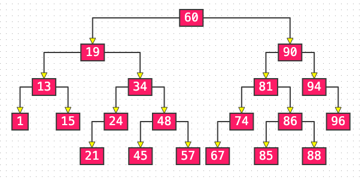

# AVL

## Balance Factor

The height between any node's left tree and right tree.

**Points**

- The Balance Factor must be 1, 0, -1 which equals |factor| <= 1
- The search, delete, add operation will cost O(logn)

## Correct lose Balance When add new Node

### LL

Left - Left

Rotation from the right.

### RR

Rotation from the left

### LR

RR -> LL

### RL

LL -> RR

## Balance when remove node

At this condition, only parent node need to balance.

- Removing a node may enable parent or ancestors node losing balance.
- The worst case is all parent node need to balance until the root.

## Sample

[94, 15, 1, 19, 90, 86, 60, 24, 48, 21, 96, 74, 34, 57, 81, 13, 85, 88, 67, 45]

Inorder
[1, 13, 15, 19, 21, 24, 34, 45, 48, 57, 60, 67, 74, 81, 85, 86, 88, 90, 94, 96]

## Summary

The average time complexity 

- Add O(logn) O(1) rotating cost
- remove O(logn) O(logn) rotating cost
- find O(logn)

**visualization**

https://www.cs.usfca.edu/~galles/visualization/Algorithms.html

